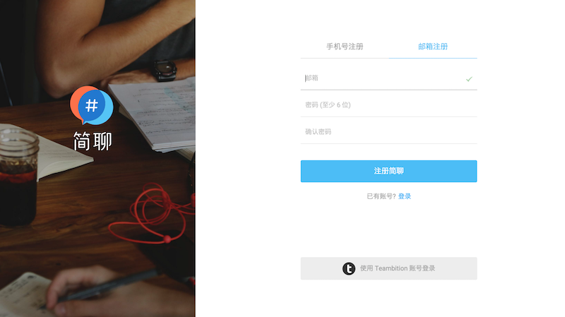
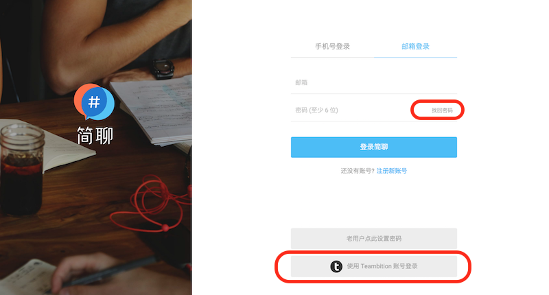
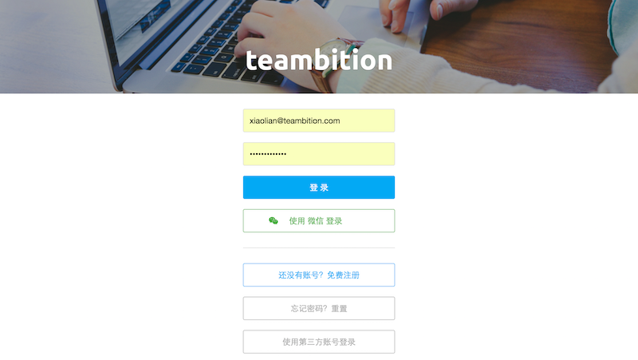
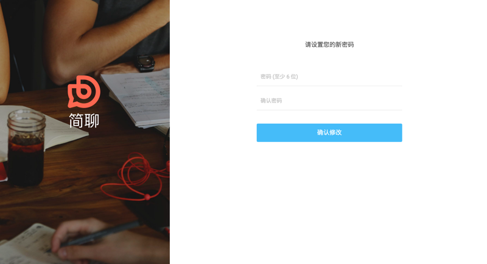

### 注册与登录

一个「简聊」账号，即可享有「简聊」的所有服务，包括及时沟通、文件上传、聚合服务（邮件、github、RSS等近百种聚合）、免费语音通话等所有企业沟通所需服务。

如果您已有简聊账号，可以直接登录使用。如果您还没有账号，现在即可注册。

#### 注册

打开简聊 ([https://jianliao.com](https://jianliao.com/))

点击右上角「注册」按钮，即可注册「简聊」。目前支持邮箱和手机号注册。注册成功后，需要创建一个团队开始您的「简聊」之旅。（关于创建团队，[点击这里](../posts/1-2-team.md) 查看详细介绍）

#### 登录

如果您已经拥有「简聊」帐号（或者 Teambition 帐号），可以直接登录简聊。打开简聊，
点击右上角「登录」按钮，输入邮箱（或手机号）和密码。点击「登录」即可。

您也可以直接点击「使用 Teambition 账号登录」通过 Teambition 帐号登录「简聊」。点击后，会跳转到 Teambition 登录页面，点击登录并授权即可。

### 修改密码

如果您忘记密码或者想修改密码，在登录页面，点击找回密码，跳转到密码重置页面。输入邮件（或手机号），点击 「发送邮件验证」（或「发送验证码」）。

然后查看「简聊」发给您的邮件（若使用手机号重置密码，输入短信验证码即可），点击「重置密码」，会跳转到新密码输入界面，输入新密码后，点击「确认修改」。

