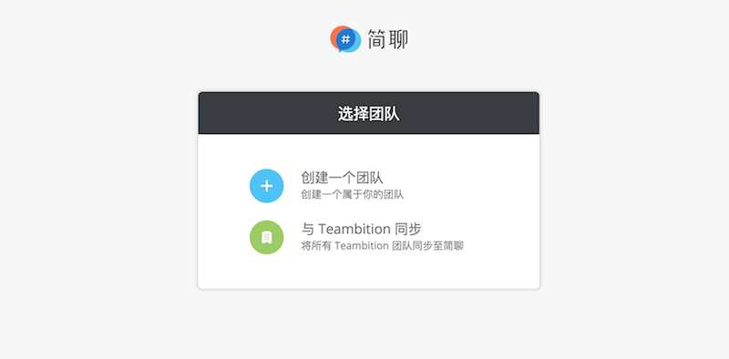
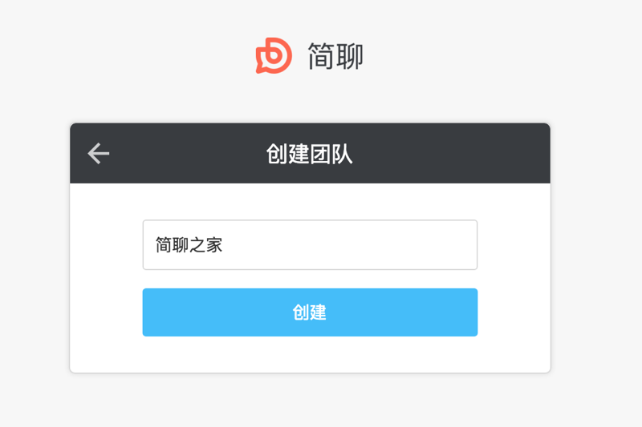
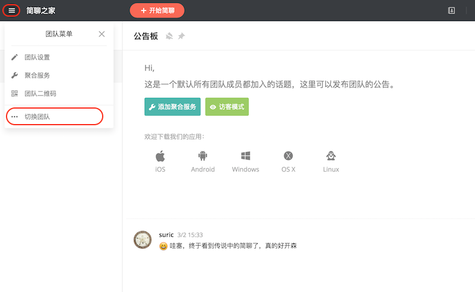
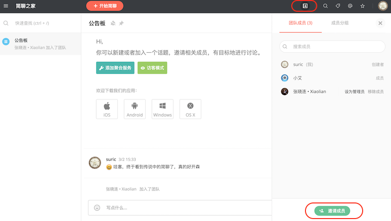
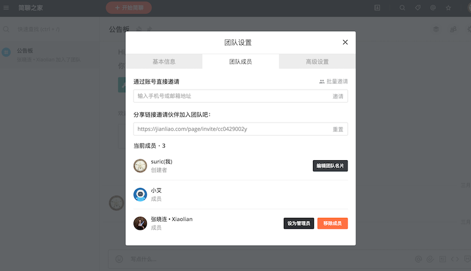

### 团队是什么

团队就是你当前工作所在团队，可以是一个创业团队，可以是公司的一个部门，也可以是一个公益组织，或者是一个发烧友团体。「简聊」以团队为基础，让一切发生在团队内部，既保证了公司信息的安全，也让多团队不再复杂。

### 如何加入团队

您可以通过以下途径加入团队

* 其他团队成员直接邀请你加入团队
* 点击其他团队的邀请链接（如何分享团队邀请链接，请看 [管理团队成员](#管理团队成员)）
* 手机端可以扫描其他团队二维码加入团队（如何分享团队邀请链接，请看 [管理团队成员](#管理团队成员)）

### 如何创建团队

如果你是新一个新用户，注册完成后，会进入选择团队页面，如果没有团队，可以创建团队。

选择 「创建一个团队」，输入用户名，点击「进入」，团队创建完成。

如果您已登录，点击左上角抽屉图标，点击「切换团队」，然后就换进入选择团队页面，创建团队即可

### 管理团队成员

您可以通过点击右上角团队联系人图标，点击「邀请成员」，添加团队成员，将光标移动到联系人上，可以将该成员设为团队管理员，或者移除该成员。

您也可以通过团队设置管理团队成员，点击左上角抽屉图标，点击「团队二维码」，他人可以扫描二维码加入团队，

点击「团队设置」，进入团队设置页面，选择团队成员。可以直接邀请和分享链接邀请成员，将光标移动到联系人上，可以将该成员设为团队管理员，或者移除该成员。

