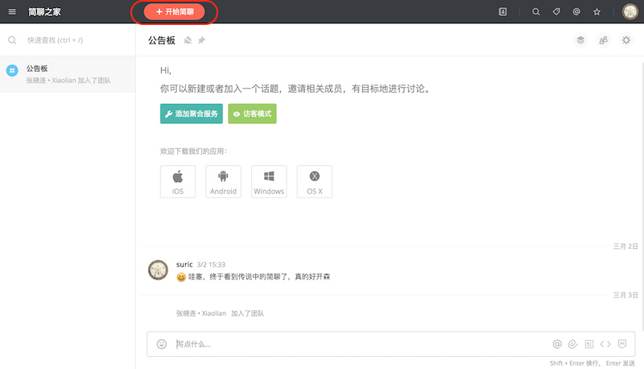
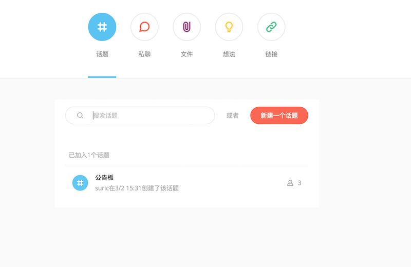
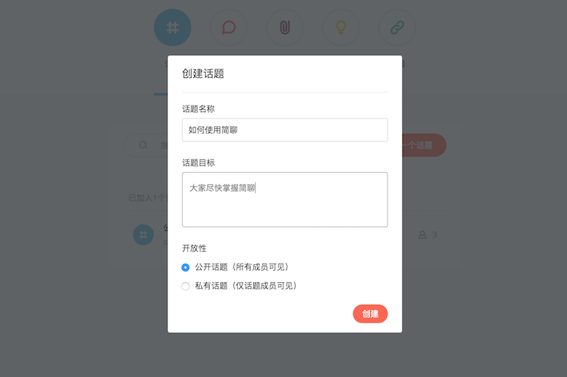
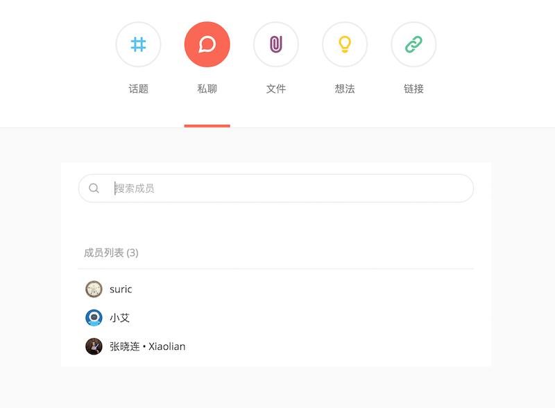
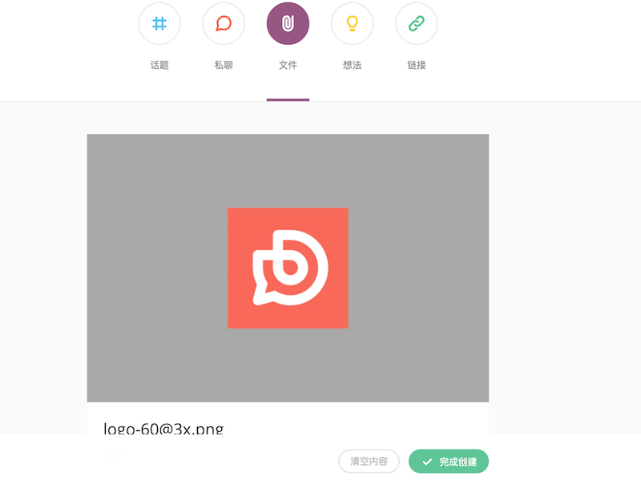
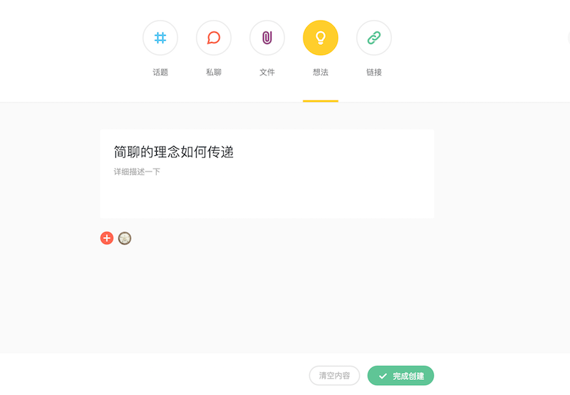
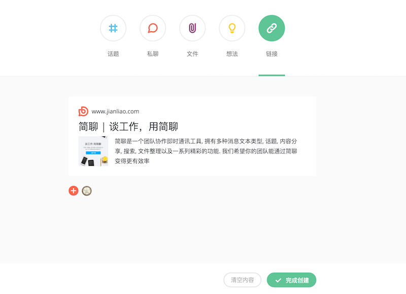

### 使用「话题」与大家群聊

话题是「简聊」的首创，让大家围绕一个话题来聊天，而不是在一个用户群里面，这样对于交流的专注度和沟通效率上有会很大的提升。公告板是默认所有成员都加入话题，主要用来发布团队的公告。

创建话题：点击主界面的上部 「开始简聊」

可以看到 「话题」「私聊」「文件」「想法」「链接」这个五个选项，

点击「新建一个话题」，进入新建话题界面，输入话题名称和话题目标，选择 「公开话题」或 
「私有话题」，点击「创建」。话题就创建成功了，然后和你的同伴打造更棒的产品吧！

### 使用「私聊」进行一对一的交流

当只想和某个成员交流时，你可以使用「私聊」功能，私聊的消息只有聊天双方可以看到，保护你的隐私。

开始私聊：「开始简聊」－>「私聊」，然后选择你要私聊的成员即可。

### 使用「分享」与团队成员更有目的的讨论

工作或生活中，经常会有一些超赞的设计和图片、奇妙的想法和有用的链接与大家分享，为了促进团队的分享和进步，简聊特别提供了「文件」「想法」「链接」这三个分享功能

创建文件分享：「开始简聊」－>「文件」，点击中间的上传图标，上传图片或文件，添加成员,然后点击「完成创建」。

创建文件分享：「开始简聊」－>「想法」，然后描述你的想法，添加成员，然后点击「完成创建」。

创建文件分享：「开始简聊」－>「链接」，输入你要分享的链接，添加成员，然后点击「完成创建」。

