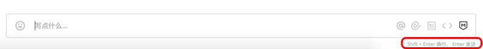
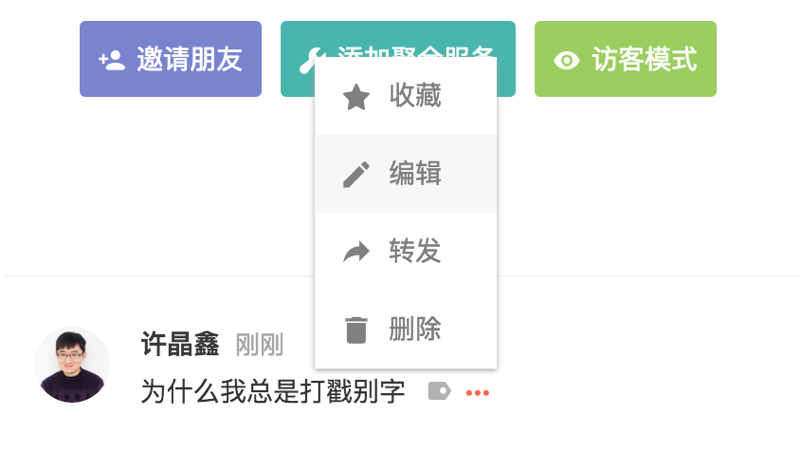
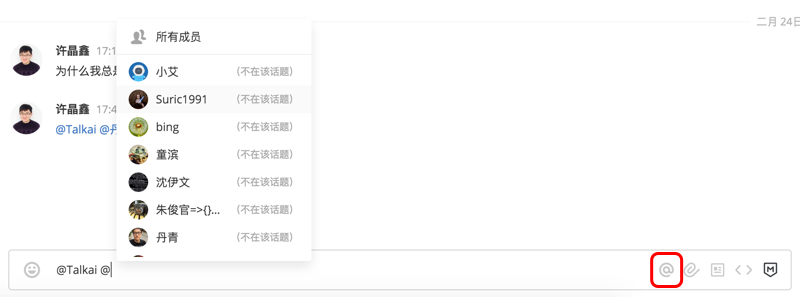
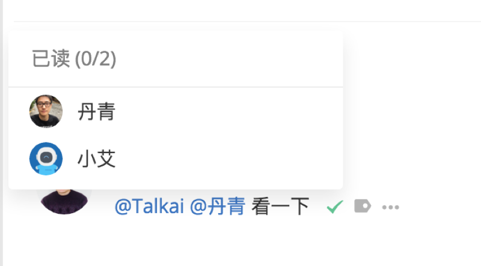
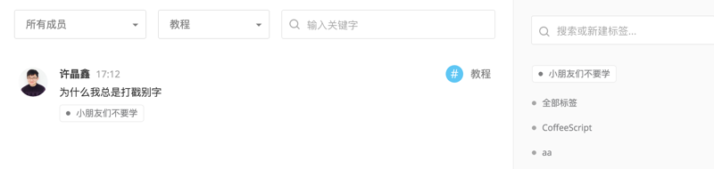
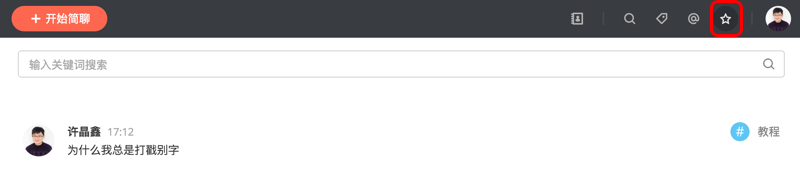

# 发送消息

进入话题或私聊后，你就可以通过下方的输入框发送消息了。简聊默认使用 「Enter」 键发送消息，你可以点击右下角按钮来切换输入模式。

# 修改消息

你可以修改自己发送的消息，在消息末尾点击「...」->「编辑」，在弹出的界面中修改消息并保存即可。

# 删除消息

如果你不再需要这条消息，或者团队中有人发布了涉及隐私的消息，团队管理员或原消息发送者可以删除这条消息。点击「...」->「删除」即可，这条消息将被永久删除，无法被撤销

# @成员

简聊中可以通过@的方式来提醒对方，即使被@的成员关闭了这个话题的通知，他也会通过手机或邮件收到你的消息。

你还可以点击消息后的小勾来查看对方是否已阅读了这条消息。

# 转发消息

你可以将任何消息转发到可见的话题或私聊中，点击「...」->「转发」->「选择发送对象」，就可以在发送对象的消息流中看到一模一样的消息啦。

\* 如果转发的是别人的消息，转发后的消息发送者则会变成你自己。

# 给消息打上标签

消息多了之后，整理和查找就变成了一件很麻烦的事情，你可以时常给重要的消息加上「标签」，这样就能很快找到以前的讨论内容啦。被添加的标签是由全团队成员共享的，阅读标签消息的权限与消息一致。

点击标签可以查看所有这个标签下的消息，并且可以根据发送者，话题，关键词分门别类的查找

# 收藏消息

如果某条消息对你个人比较重要，那么你可以选择「收藏」这条消息，点击「...」->「收藏」即可。你可以在右上角星号中找到收藏过的消息，并且可点击消息来查看原讨论中的上下文。

\* 消息可以被重复的收藏，一旦原消息的内容有了更新，再次点击收藏，就可以更新收藏的消息内容啦。
