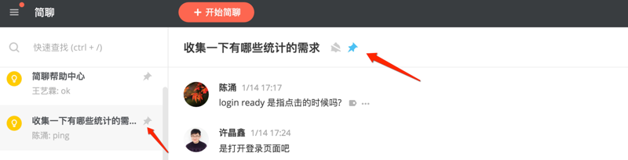
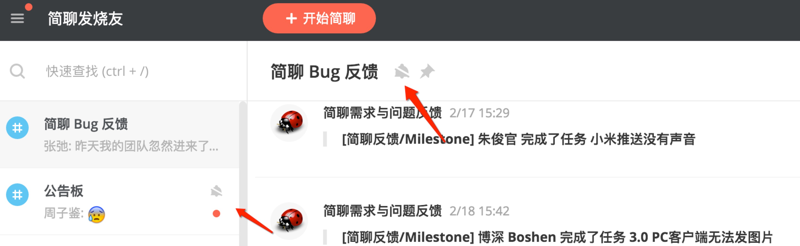
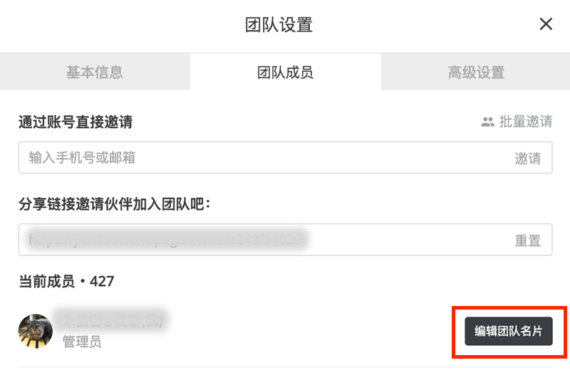
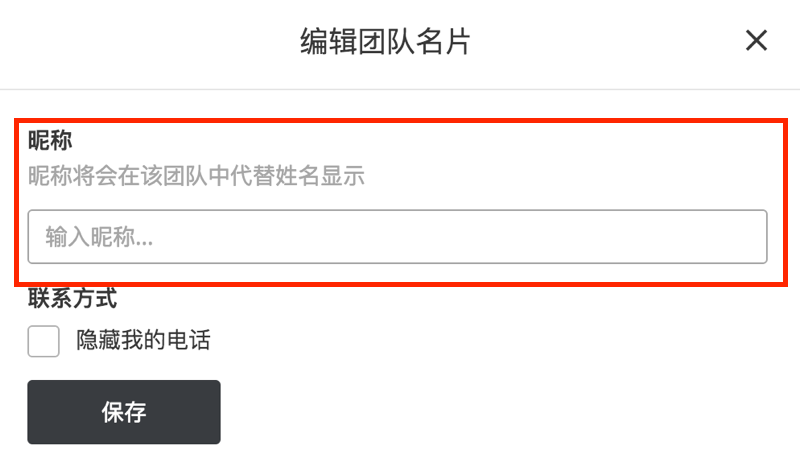
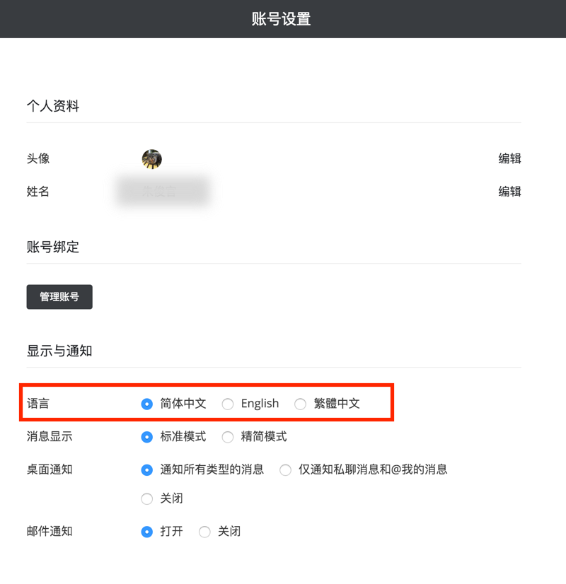

# 置顶通知

当左侧边栏通知过多时查找起来会有困难。简聊提供了通知置顶功能，可以将通知固定在左侧边栏的上方，以便快速查找。

点击聊天标题栏上的「图钉」按钮，即可将该通知置顶，此时该通知位于左侧边栏的最上方并出现「图钉」标识，再次点击按钮即可取消置顶。

# 消息免打扰

简聊可以将指定对话的消息提醒暂时关闭，点击聊天标题栏上的「铃铛」按钮，即可关闭消息提醒，此时有新消息时将没有提醒，通知栏只显示一个红点，不再显示消息数，再次点击按钮可恢复提醒。

# 隐藏手机号

绑定手机号的用户在团队名片会默认显示手机号联系方式，某些用户如果希望隐藏手机号的话可以在团队设置界面 -> 选择「团队成员」页面 -> 点击「编辑团队名片」 -> 勾选「隐藏我的电话」，团队名片就不会再出现手机号了。

# 设置你在团队中的别名

简聊允许用户在团队中使用昵称替代姓名来显示，设置方法如下：「团队设置」 -> 「团队成员」 -> 「编辑团队名片」-> 输入昵称

# 国际化语言设置

简聊web版当前支持简体中文，繁体中文和英语3种语言选项，可以点击右上角用户头像 -> 选择「账号设置」 -> 选择希望设置的语言

