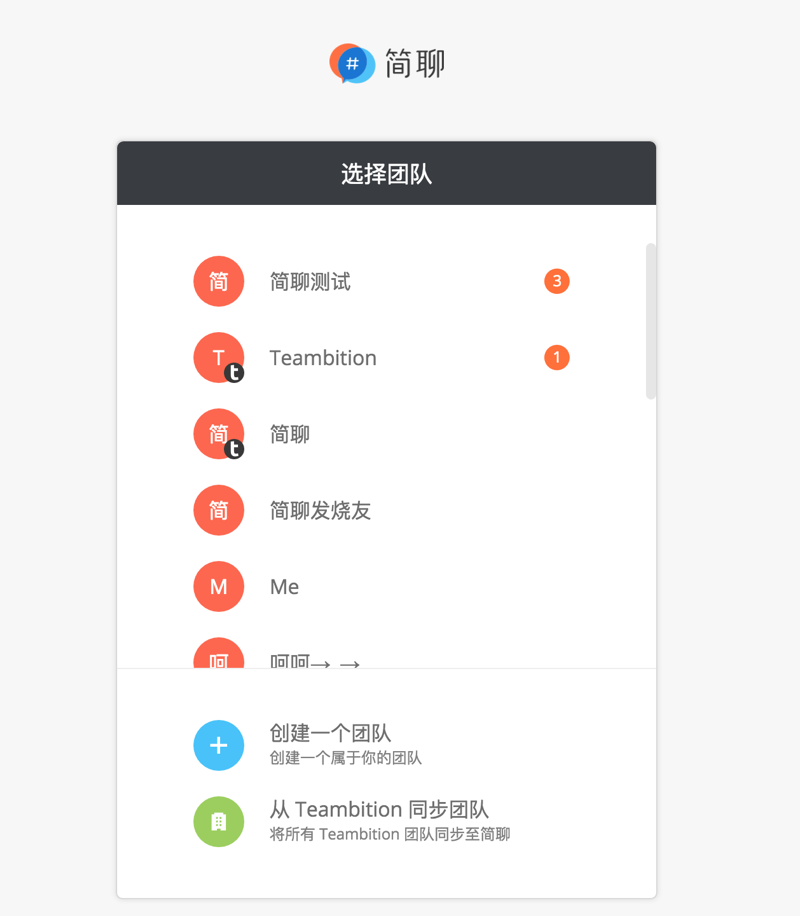

# 切换团队

简聊可以支持一个用户同时属于多个团队，需要切换时点击展开左上角「团队菜单」，点击需要切换的团队名称即可切换团队。如果用户的团队数量较多，可能没有显示在「团队菜单」中，可以选择「切换团队」，进入选择团队页面便可以看到所有团队。

# 来自其他团队的消息与通知

用户在当前团队如果收到其他团队的消息，左上角「团队菜单」按钮会出现一个红点，展开「团队菜单」或进入「切换团队」页面可以看到其他团队的未读消息数。
