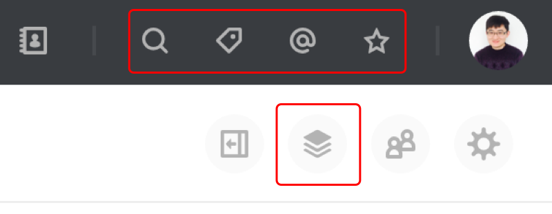

# 查看所有@我的消息

点击右上角「@」按钮可以查看最近「@我」的消息，点击单条消息可以查看原消息的上下文

# 自动整理

话题和私聊中的文件，链接，富文本类消息会被「简聊」自动分类整理，点击右上角的整理按钮，可以查看这些消息内容，当你发送这些消息时，它们会自动出现在右侧的列表中。

# 筛选文件/链接/富文本/代码片段

点击右上角的放大镜图标可以进入消息搜索，支持筛选话题，私聊，消息类型，文件类型，创建时间等

# 通过关键词搜索消息

「简聊」可通过模糊关键词查找你想要的消息，越准确的关键词，找到消息的概率就越高。现在就试试输入「天气」来查找一下小艾发送给你的天气信息吧。

# 搜索收藏的消息

收藏的消息也可以通过关键词查找，可以帮助你更快的定位到想要的消息
