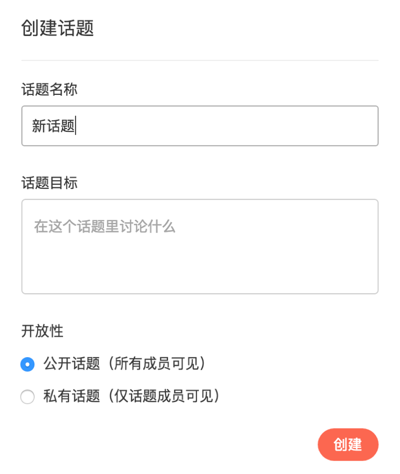
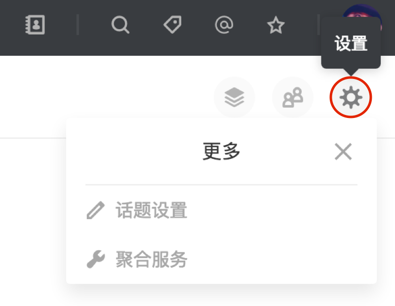
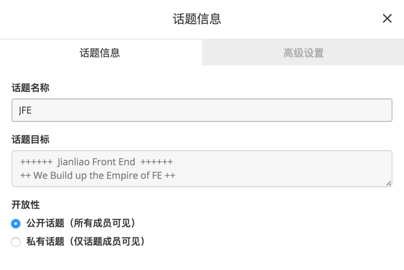
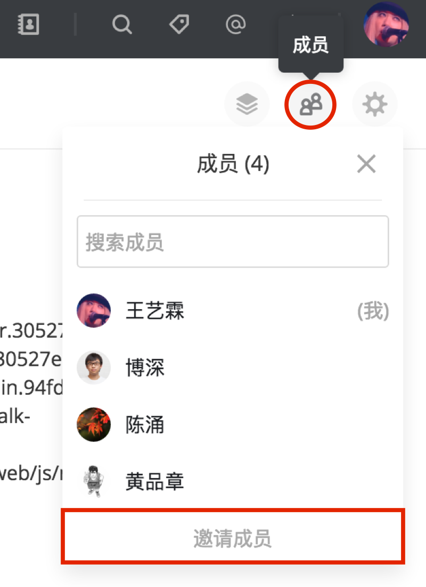
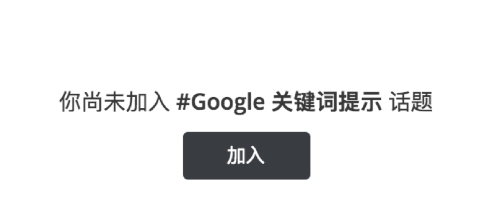
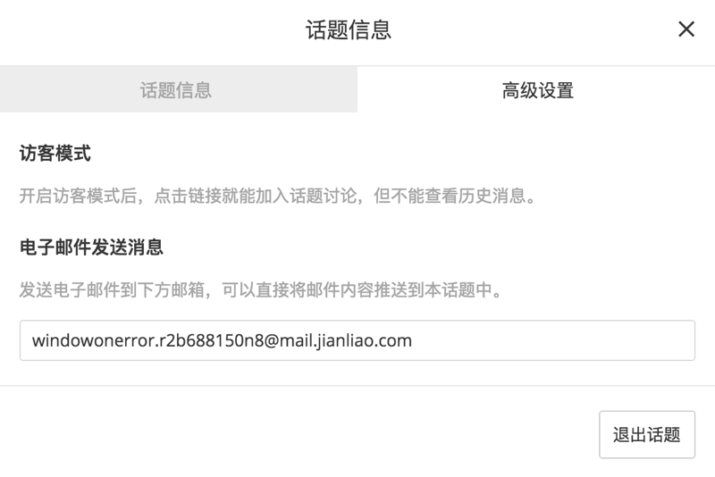

话题是一个有目标的讨论组，适用场景如一次活动的筹备或一个组织的日常讨论。

# 创建话题

可以通过「开始简聊」进入话题页新建话题。
创建话题时必须填写话题名称。话题开放性分为公开（团队所有成员可见）和私有（仅话题成员可见），默认为公开，可以根据需求进行选择。
为了讨论更有重点，可以设置话题目标。

# 话题目标

话题目标是一个话题的讨论重心，设置以后可以在右上角菜单的「更多」->「话题设置」中查看。

# 话题成员管理

查看成员列表，或邀请和管理成员可以通过右上角菜单中的的「成员」进入，话题中任何成员都可以邀请团队内其他人加入话题，也可以自由退出话题。团队管理员和话题创建者还拥有移除成员的权限。

团队管理员和话题创建者还拥有更多权限：重置话题名称或话题目标、更改话题的开放性、开关话题的访客模式，也可以在讨论结束后删除或归档话题。这些操作都可以在话题菜单的「更多」中找到。

\*「公告板」是每个团队默认配置的话题，管理员可以设置他的话题目标和开关访客模式，但是任何人都无法退出或操作其它属性。

# 公开与私有

话题分为公开话题和私有话题。在「开始简聊」的话题页中有「已加入的话题」，「未加入的话题」和「已归档」话题的列表。未加入的公开话题会显示在「未加入的话题」中，可以点击进入预览并自由加入感兴趣的话题。而私有话题只能由该话题中的成员邀请加入。

# 自动绑定邮箱

每个话题一经创建，都会产生一个自动绑定的电子邮箱。可以在「话题设置」-> 「高级设置」中查看。发送电子邮件到该邮箱可以直接将邮件内容推送至该话题中。

