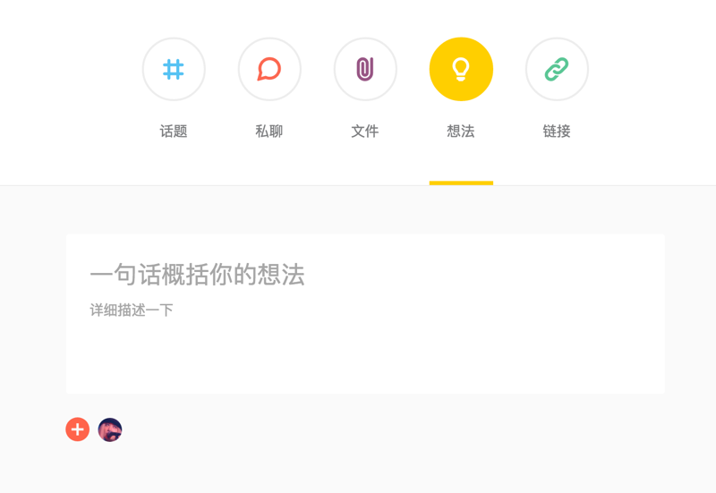
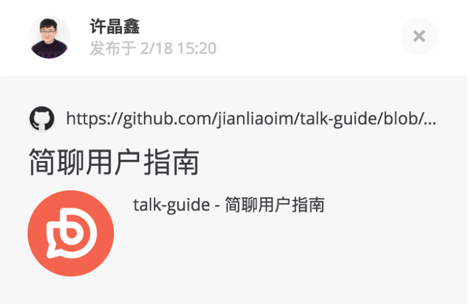
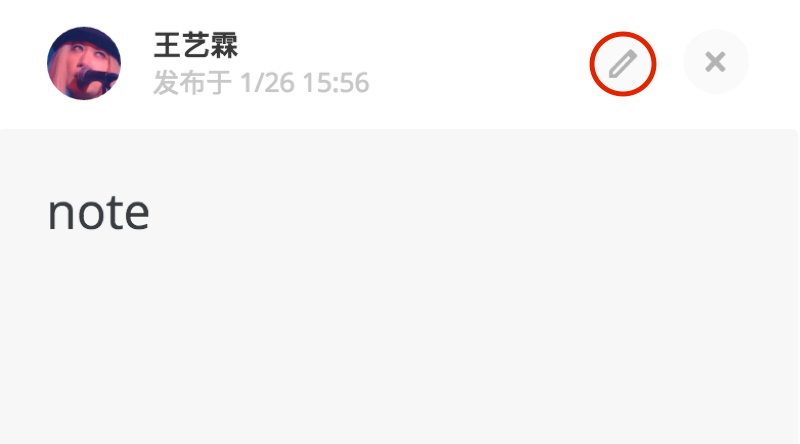
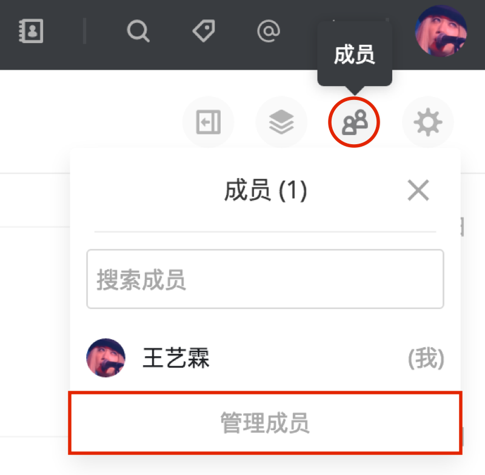
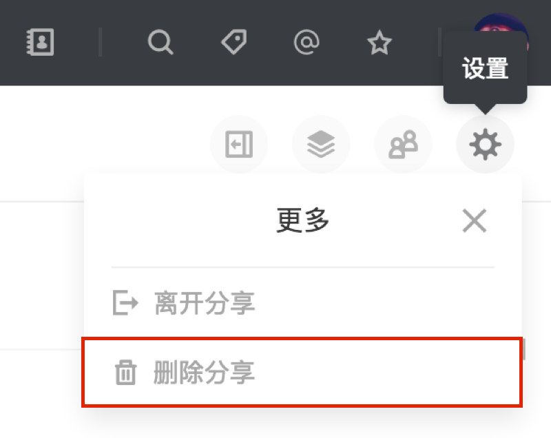

不同于话题，分享适用于更具时效性的讨论。讨论的主体围绕分享的详情展开。
比如团队中的设计师分享一个设计稿，运营分享一个活动链接，或者整个团队发起一次头脑风暴。

### 创建分享

可以通过顶部的「开始简聊」按钮进入新建。简聊提供三种常用的分享模式：想法、文件（移动端为图片）、链接。

### 查看分享内容

创建分享后，可以通过右上角的「详情」图标查看分享详情。

### 修改分享

查看分享详情时，团队管理员或分享创建者可以点击详情右上角的「编辑」图标编辑内容。

### 管理参与者

与话题类似，分享内的成员可以通过右上角的「成员」图标查看成员列表，也可以邀请或管理成员。

### 删除分享

团队管理员或分享创建者可以通过右上角的「更多」->「删除分享」删除分享。

