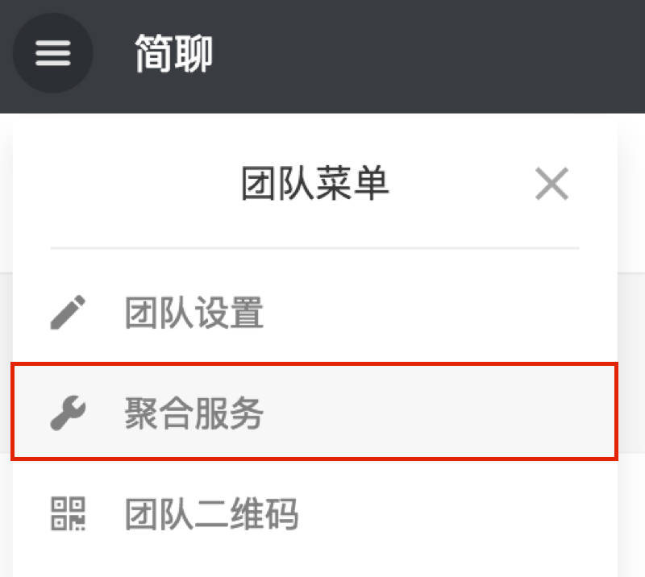
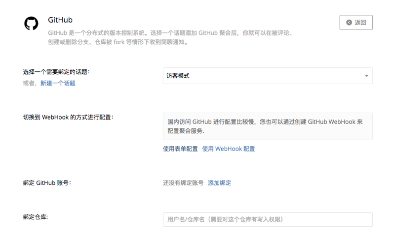

聚合服务帮助你汇集各种工作通知，方便团队讨论和及时跟进项目。

# 聚合介绍

可以通过团队菜单或话题菜单的「聚合服务」进入为团队或相应话题配置聚合服务。

在打开的聚合列表中选择要添加的聚合服务后，会看到详细的配置说明。

配置完成后，还可以查看已有聚合，进行修改或删除。

# 查看详细聚合列表

[已有聚合列表](https://jianliao.com/site/product/integrations)
