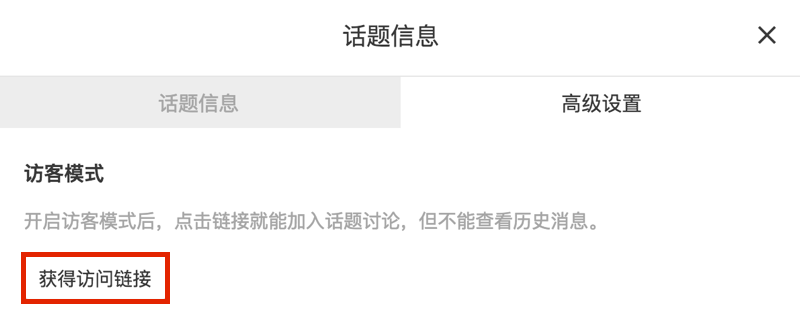
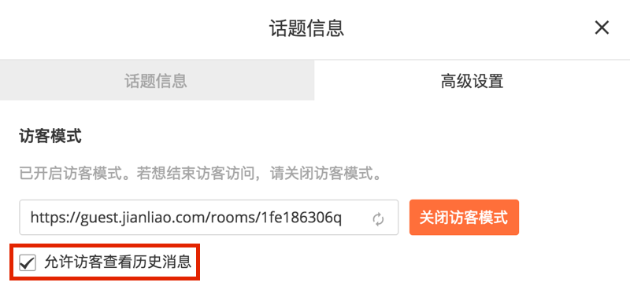
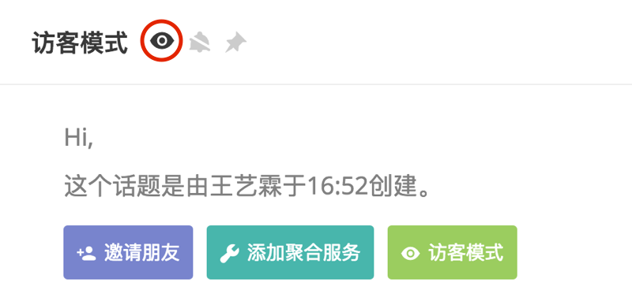

话题拥有访客模式，访客模式下的话题允许不在团队内的人通过邀请链接访问，保证团队的纯粹性的同时方便了一些必须的外部交流。

### 开启与关闭

团队管理员或话题创建者可以通过「话题设置」-> 「高级设置」中开启或关闭访客模式，并获得一个访问链接。
普通成员可以在「话题设置」-> 「高级设置」中查看已开启访客模式的话题的访问链接。
访客模式开启后在话题名旁会出现一个「眼睛」图标。

### 是否可见历史消息

开启访客模式后可以选择是否让访客看到开启访客模式前的历史消息。

### 访问访客页面

通过邀请链接可以访问开启访客模式的话题。填写用户名（或邮箱）进入该话题，可以和话题内的人进行交流，并且拥有自己消息的编辑权限。
