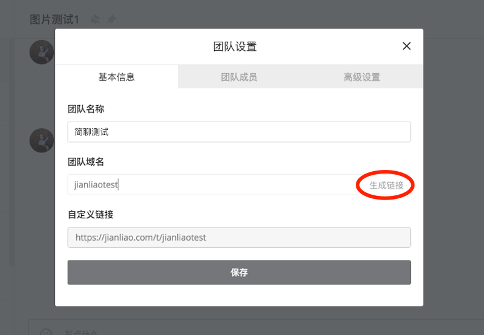
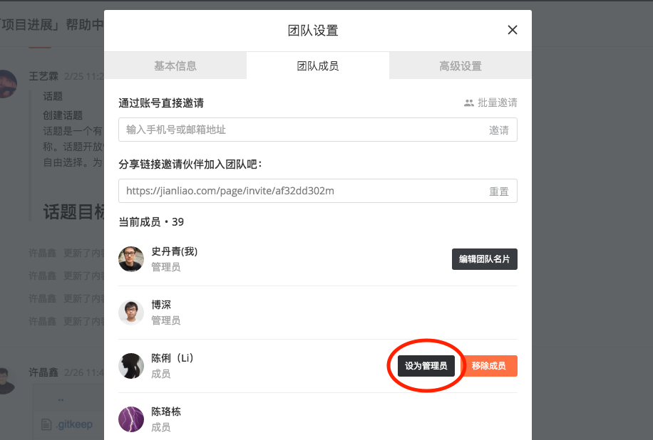
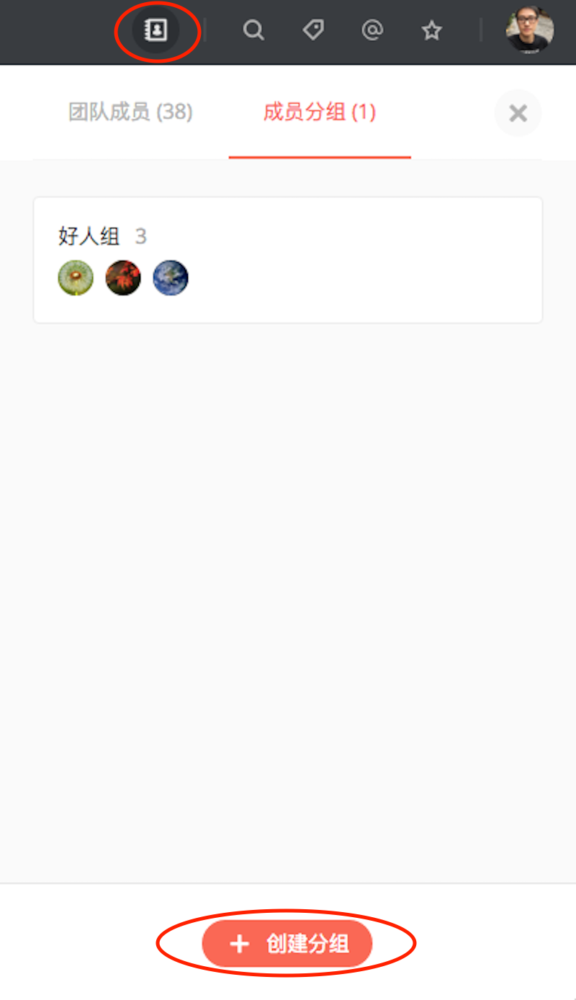
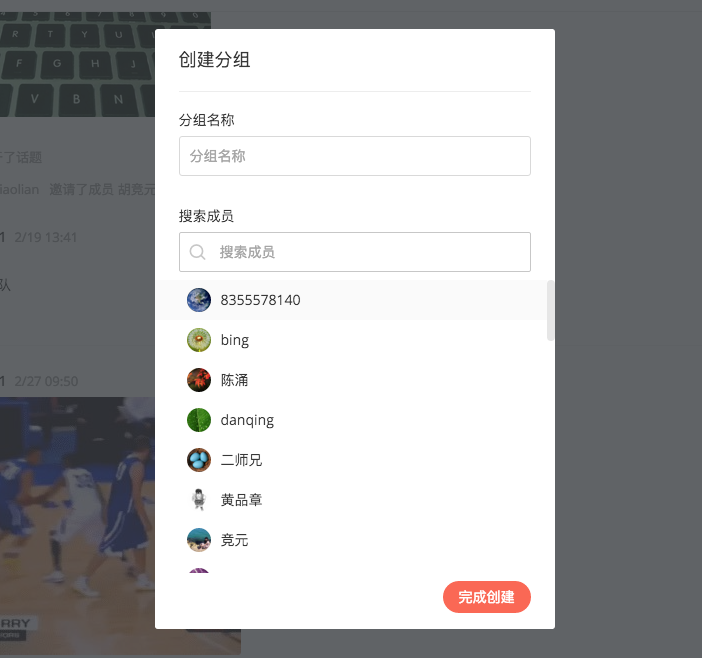
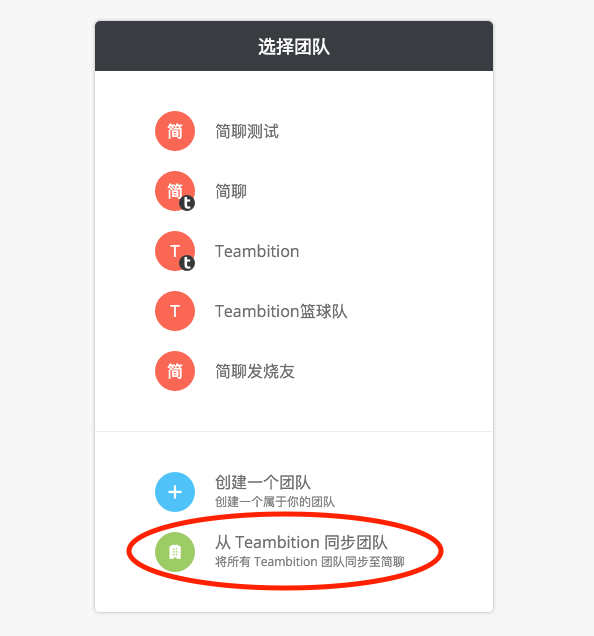
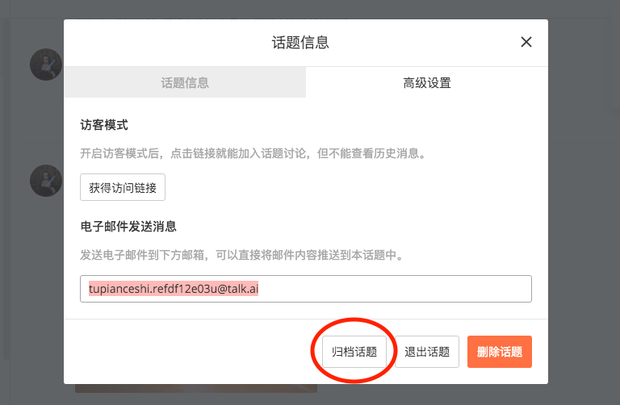

# 团队名称与短域名

管理员可以通过左上角「团队菜单」->「团队设置」->「基本信息」修改团队名称与短域名。自定义团队短域名后，如下图中点击「生成链接」，会生成属于你团队专属的链接地址。修改完成后点击「保存」生效。

*短域名概念：用户可通过设置后的短域名，直接进入「简聊」团队页面。

# 成员权限管理

管理员可以设置每个团队成员的权限，可以将「成员」设置为「管理员」，也可以将「管理员」取消为「成员」。具体的设置方法为左上角「团队菜单」->「团队设置」->「团队成员」。

# 将成员按特定分组归类

管理员可以将团队成员按特定分组归类，创建新成员分组或者编辑存在的成员分组。这里以创建成员分组为例，右上角「通讯录」->「成员分组」->「创建分组」，进入后填写分组名称并勾选成员完成创建。

# 从Teambition同步成员

如果你已经是Teambition的企业用户了，并且希望将你的团队成员全部同步到简聊，那你可以使用Teambition同步的功能。左上角「团队菜单」->「切换团队」->「从Teambition同步团队」，确认你的账号已经绑定了Teambition账号，此时可以同步团队。

# 定期管理您的话题，将不再活跃的话题归档

当你发现某些话题不再活跃时，你可以归档该话题。点击话题右上角「设置」->「话题设置」->「高级设置」，选择「归档」。该话题可以在「已归档话题」中被找到。

# 统计数据

